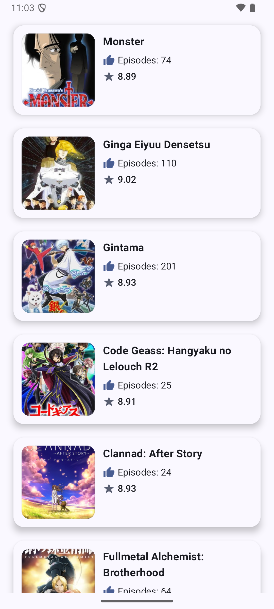
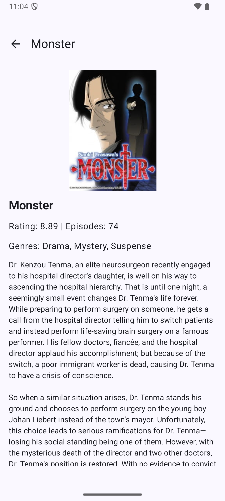

# Overview

* This is a simple Android app built using Jetpack Compose, MVVM, and Clean
* Architecture. It fetches and displays a list of anime from the Jikan API,
* with offline caching support using Room. 
* Users can view anime details, including trailers, 
* ratings, episodes, and synopsis.

# Features

- Top anime list with title, episodes, score, and poster.
- Anime detail page with trailer or poster, genres, rating, episodes, and synopsis.
- Offline support via Room database.
- Network-aware fetching: fetches data from API only if connected.
- Loading, error, and retry states handled in ViewModel.
- Clean architecture with Repository, UseCase, and UI layer.
- Dependency injection using Hilt.

# Tech Stack

- Kotlin, Jetpack Compose
- MVVM + Clean Architecture
- Retrofit + Gson (API)
- Room (Local caching)
- Hilt (DI)
- Coil (Image loading)
- StateFlow / Flow (Reactive UI)

# Architecture

  * Presentation Layer
     - Composable UI screens: AnimeListScreen, AnimeDetailScreen
     - ViewModels expose StateFlow objects to represent UI states (loading, success, error)

  * Domain Layer
    - UseCases: GetTopAnimeUseCase, GetAnimeDetailUseCase

  * Data Layer
    - Repository: AnimeRepositoryImpl
    - Handles API calls via Retrofit

# Caches data in Room

 - Handles offline + online logic using networkBoundResource
 - Dependency Injection
 - Hilt provides API, Database, Repository, and UseCases

# Offline Behavior

- Listing Page: shows cached anime if offline, fetches from API if online. 
- Detail Page: shows cached anime if offline, fetches from API if online

# ScreenShot

  * Listing Page
     - 
  * Detail Page
     - 